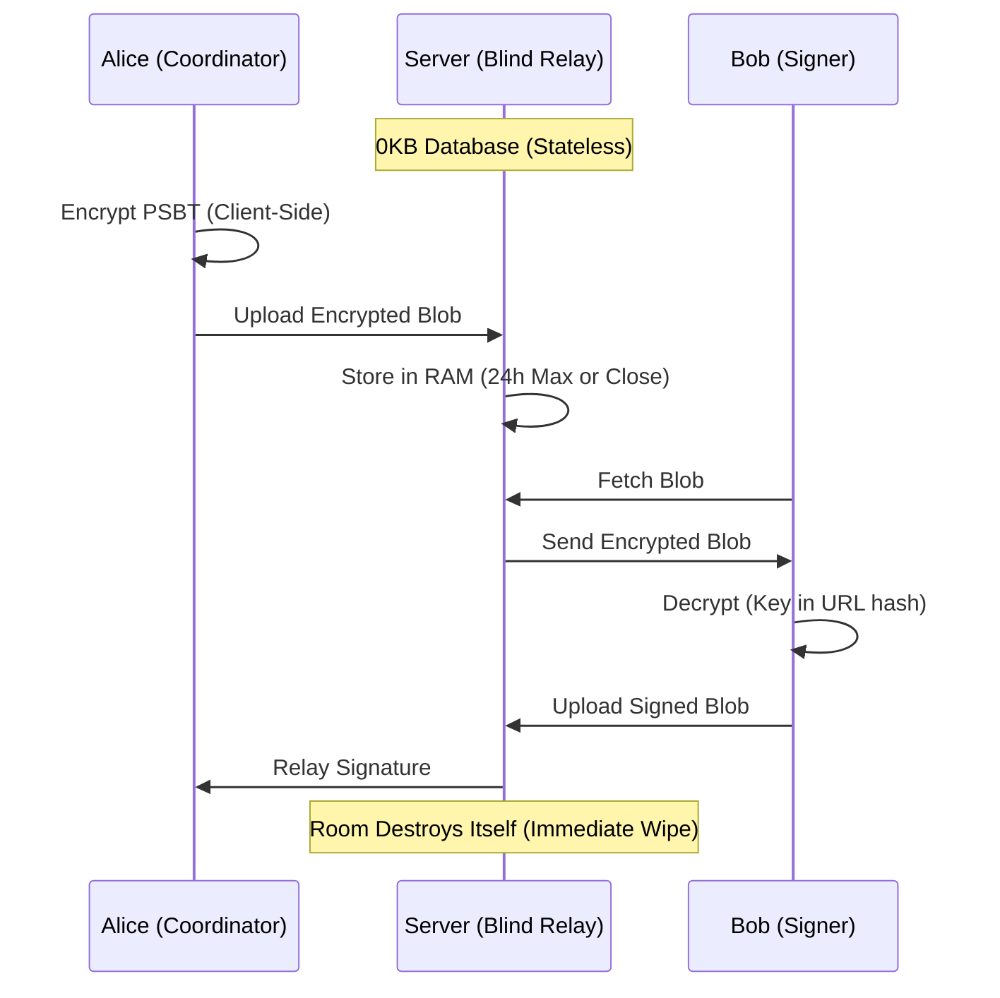

# Signing Room® (SigningRoom.io)

[](https://github.com/scarlin90/bip-stateless-psbt-coordination/blob/main/bip-draft.md)
[](https://signingroom.io)
[](https://arxiv.org/abs/2601.17875)
[](https://www.ulster.ac.uk/)

> **Stateless. Zero-Knowledge. Real-Time.**  
> A stateless coordination layer for Bitcoin multisig transactions.


[](./site_metric_logs/MANIFEST.md)
[](https://scorecard.dev/viewer/?uri=github.com/scarlin90/signingroom)

### 📦 Official SDK Ecosystem

Integrate Signing Room directly into your own infrastructure.

**1. Core TypeScript SDK**  
Framework-agnostic library for programmatic, event-driven multisig coordination.

- **NPM:** [`@signing-room/sdk`](https://www.npmjs.com/package/@signing-room/sdk)
- **Source & Demos:** [libs/sdk](https://github.com/scarlin90/signingroom/tree/main/libs/sdk)

**2. Drop-In Web Component**  
Add non-custodial multisig UI to any application with a single HTML tag (`<signing-room>`).

- **NPM:** [`@signing-room/embed`](https://www.npmjs.com/package/@signing-room/embed)
- **Interactive Demo:** [Web Component Sandbox](https://signingroom.io/webcomponent-demo.html)

---

### ⚠️ Disclaimer

**Trademark Notice:** **"Signing Room"** is a registered trademark of **Stateless Research Ltd** in the United Kingdom.

**THIS SOFTWARE IS PROVIDED "AS IS", WITHOUT WARRANTY OF ANY KIND.**

SigningRoom is an open-source coordination tool — **not** a wallet, custodian, or financial institution.

- We do **not** hold your private keys.
- We do **not** hold your funds.
- We **cannot** recover lost data (rooms are ephemeral and exist only in RAM).

You are solely responsible for verifying every transaction detail (address, amount, fees) on your hardware device screen before signing.

---

**SigningRoom** replaces the insecurity of emailing files and the friction of USB sticks with a secure, ephemeral, real-time signing room.  
We do not want your data. We cannot read your data.

## 🏴 The Manifesto

1. **Human Rights via Physics**  
   We enforce **UN Article 20 (Freedom of Assembly)** and **Article 12 (Privacy)** not through policy, but through physics. Ephemeral Durable Objects that self-destruct ensure the "Right to Coordinate" survives even in hostile jurisdictions.

2. **Statelessness is Security**  
   Databases are liabilities. SigningRoom stores data in RAM (Cloudflare Durable Objects) only for the duration of the session. When the room expires, the data ceases to exist.

3. **Zero Knowledge**  
   All transaction data is encrypted **client-side** (AES-256-GCM) before it ever touches the network. The decryption key lives only in the URL fragment (`#key`), which is never sent to the server.

4. **Don't Trust, Verify**  
   The client is verifiable. The cryptography is standard (Web Crypto API). The code is open.

## 📊 Operational Transparency

As a privacy-focused public good we publish verifiable metrics instead of asking for blind trust.

We regularly publish raw logs and historical performance data here:  
**[View the Site Metrics Manifest →](./site_metric_logs/MANIFEST.md)**

### 🛡️ Transparency & Audits

- **Infrastructure Integrity** — Raw exported logs and historical performance data are logged publicly.
- **Software Bill of Materials (SBOM)** — Every automated release generates a CycloneDX SBOM (aligned with EU Cyber Resilience Act guidelines). Artifacts are retained for 90 days.
  - [Download latest deployment SBOM artifacts](https://github.com/scarlin90/signingroom/actions/workflows/ci-cd.yml)

### 📋 Compliance & Governance Documentation

- [Architecture](./docs/architecture.md)
- [Regulatory Scope & Compliance Boundary](./docs/compliance/regulatory-scope.md)
- [Incident Response Runbook](./docs/compliance/incident-response-runbook.md)
- [Technical Security & Compliance Roadmap](./docs/compliance/technical-roadmap.md)
- [Security Policy](./SECURITY.MD)

## 🔬 Research & Standards

This software is the reference implementation of **"The Stateless Pattern"** — a cryptographic architecture formalized for peer review and Bitcoin protocol standardization.

> 📜 **Bitcoin Improvement Proposal (BIP)**  
> **[Draft: Stateless PSBT Coordination Relay](https://github.com/scarlin90/bip-stateless-psbt-coordination/blob/main/bip-draft.md)**  
> Defines a standard for ephemeral, encrypted PSBT transport to ensure interoperability between stateless relays and coordinators.

> 🎓 **Academic Whitepaper**  
> Carlin, S. & Curran, K. (2026). _The Stateless Pattern: Ephemeral Coordination as the Third Pillar of Digital Sovereignty._ arXiv:2601.17875.  
> [](https://arxiv.org/abs/2601.17875)

## ⚡ Features

- **Multi-Network Support** — Mainnet, Testnet, and Signet.
- **PWA** — Installable on iOS/Android directly from the browser (censorship-resistant, no App Store required).
- **Real-Time Sync** — WebSockets for instant state propagation between signers.
- **Hardware Agnostic** — Coldcard, Sparrow, Electrum, Ledger, Trezor, and any BIP-174 compatible wallet.
- **Ephemeral Rooms** — All rooms and data self-destruct after 24 hours.
- **Audit Logs** — Client-side, cryptographically verifiable PDF audit trail of the signing ceremony, including persistent witness tracking for disconnected signers.

## 🛠️ Architecture

SigningRoom uses a **"Blind Relay"** architecture. It acts as a temporary switching station, not a warehouse.



For the full system architecture (monorepo layout, component dependencies, and enterprise white-label / self-hosted model), see:

**[Architecture Documentation](./docs/architecture.md)**

## 🗺️ Roadmap (2026)

We are actively seeking funding and grants to evolve SigningRoom from a standalone tool into ubiquitous Bitcoin multisig infrastructure.

### Phase 1: The Core — ✅ Completed

- [x] Launch `signingroom-core` on Mainnet, Testnet, and Signet (v1.0)
- [x] Deploy censorship-resistant Progressive Web App (PWA)

### Phase 2: Ubiquity — ✅ Completed

- [x] BIP Draft submitted (Stateless Encrypted WebSocket Coordination for PSBTs)
- [x] Web Component (`<signing-room>`) — drop-in HTML element
- [x] Extended Web Component events for compliance and governance

### Phase 3: 🔴 Active Grant Target (Q3 2026)

- [x] TypeScript Client Library
- [x] YouTube SDK walkthrough
- [x] Docker images and setup
- [ ] Tapscript support
- [ ] **Stealth Room** — Prototype OHTTP with WebTransport / QUIC and MASQUE
- [ ] **Public API** — Well-documented API for automated agents and services

**Status:** Phase 1 & 2 complete. Phase 3 (Stealth Room + Public API) is the current focus and primary grant target.

## 💰 Support Public Infrastructure

SigningRoom is Free and Open Source Software (FOSS), maintained for the public good. If this tool helps you or your organization, please consider supporting its maintenance.

- [OpenSats](https://opensats.org) — Application received initial rejection (Q1); feedback was to strengthen the BIP — actively drafting.
- [Human Rights Foundation](https://hrf.org) — Bitcoin Development Fund (deferred to Q3 2026)
- [Donate via Lightning](https://e94152ca5a.d.voltageapp.io/lnurlp/link/kfjCoo)

[](https://e94152ca5a.d.voltageapp.io/lnurlp/link/kfjCoo)

## 🚀 Quick Start (Development)

**Prerequisites:** Docker Desktop **or** Node.js v20+.

### Option A: Docker Compose (Recommended)

```bash
git clone https://github.com/scarlin90/signingroom.git
cd signingroom
docker compose up --build
```

- Frontend: http://localhost:4200
- Worker: http://localhost:8787

Stop with `Ctrl+C` then `docker compose down`.

### Option B: Native Local Setup

```bash
git clone https://github.com/scarlin90/signingroom.git
cd signingroom
npm install

# Terminal A – Worker
cd apps/worker
npx wrangler dev

# Terminal B – Client (from project root)
npx nx run client:serve --configuration=development
```

- Frontend: http://localhost:4200
- Worker: http://localhost:8787

## 🏰 Self-Hosting (Sovereign)

You should never be locked into a platform. While SigningRoom.io offers a hosted demo, you are free to run your own infrastructure.

### Option 1: Pre-Built Container Images (GHCR)

Official images are **keylessly signed** (Cosign), **OpenSSF SLSA Level 3 attested**, and scanned with Trivy.

| Component | Image                                      |
| --------- | ------------------------------------------ |
| Worker    | `ghcr.io/scarlin90/signingroom/worker:dev` |
| Client    | `ghcr.io/scarlin90/signingroom/client:dev` |

Packages:

- [Worker](https://github.com/scarlin90/signingroom/pkgs/container/signingroom%2Fworker)
- [Client](https://github.com/scarlin90/signingroom/pkgs/container/signingroom%2Fclient)

```bash
curl -O https://raw.githubusercontent.com/scarlin90/signingroom/main/docker-compose.ghcr.yml
docker compose -f docker-compose.ghcr.yml pull
docker compose -f docker-compose.ghcr.yml up -d
```

### Option 2: Build from Source

```bash
git clone https://github.com/scarlin90/signingroom.git
cd signingroom
docker compose up -d --build
```

### Environment Variables (Worker)

| Variable         | Description                              | Local Default           |
| ---------------- | ---------------------------------------- | ----------------------- |
| `ALLOWED_ORIGIN` | Frontend origin allowed by CORS          | `http://localhost:4200` |
| `API_PUBLIC_URL` | Public Worker API endpoint               | `http://localhost:8787` |
| `ENVIRONMENT`    | `development` / `staging` / `production` | `development`           |

### Option 3: Managed Edge (Cloudflare)

```bash
npm run deploy:worker
npm run deploy:client
```

Configure `wrangler.jsonc` (or the Cloudflare Dashboard) with the same environment variables above, pointing to your production domains.

### 🔒 Supply Chain Verification

Every official container release includes:

- Keyless Sigstore **Cosign** signatures
- **OpenSSF SLSA Level 3** provenance attestations
- CycloneDX **SBOM**
- Automated **Trivy** vulnerability scanning
- Immutable GitHub Actions build provenance

Example verification (after installing `cosign`):

```bash
cosign verify \
  --certificate-identity-regexp="https://github.com/scarlin90/signingroom" \
  --certificate-oidc-issuer=https://token.actions.githubusercontent.com \
  ghcr.io/scarlin90/signingroom/worker:latest
```

**Environment Variables**

### 🔒 Supply Chain Verification

Every official container release includes:

- Keyless Sigstore **Cosign** signatures
- **OpenSSF SLSA Level 3** provenance attestations
- CycloneDX **SBOM**
- Automated **Trivy** vulnerability scanning
- Immutable GitHub Actions build provenance

Example verification (after installing `cosign`):

```bash
cosign verify \
  --certificate-identity-regexp="https://github.com/scarlin90/signingroom" \
  --certificate-oidc-issuer=https://token.actions.githubusercontent.com \
  ghcr.io/scarlin90/signingroom/worker:latest
```

## 🧪 Testing & Quality Assurance

The most reliable way to run the full suite (unit + E2E) is inside Docker.

```bash
# Build the test image
docker build -t signing-room-tests -f Dockerfile.test .

# Run the suite
docker run --rm signing-room-tests
```

### Local Development Commands

```bash
# Client unit tests
npx nx run client:test

# Worker tests
npx nx run worker:test

# Interactive Playwright UI
# (temporarily remove the Docker-specific --ip/--port flags from playwright.config.ts)
npx nx e2e client-e2e --ui
```

## 🤝 Contributing

SigningRoom is developed and maintained by **Stateless Research Ltd**.

At this time we are **not accepting external code contributions** without a prior Contributor License Agreement (CLA). This is required because the project is dual-licensed (AGPLv3 + commercial) and owned by the company.

If you would like to contribute code, please:

1. Open an issue describing the proposed change
2. Contact us so we can send you the CLA

We warmly welcome:

- Bug reports
- Feature suggestions
- Security disclosures (see [SECURITY.MD](./SECURITY.MD))
- Documentation feedback (via issues)

## 🏢 Enterprise & Commercial Licensing

SigningRoom.io is fully open-source under the **AGPLv3**.

- **Community use** — Free. If you modify the code and host it publicly you must open-source your changes.
- **Commercial use** — Institutions that need an AGPL waiver to integrate into proprietary/closed-source systems should contact **Stateless Research Ltd**.

> 🔗 [Contact Stateless Research for Licensing](https://statelessresearch.com)

## 📄 License

Distributed under the GNU Affero General Public License v3.0 (AGPL-3.0).
If you modify this code and run it over a network, you must release your source code. See [LICENSE](./LICENSE) for details.

## 🔐 Security

If you discover a vulnerability, **do not** open a public issue.

Please follow our responsible disclosure process:

- See **[SECURITY.MD](./SECURITY.MD)** for the full vulnerability disclosure policy
- Email: security@signingroom.io
- PGP Fingerprint: `C642 EB5E 3EB8 5194 98CF 6535 97A4 B80F 7970 DD56`

---

Built with 🧡 and ⚡ by **Stateless Research Ltd**.
**Signing Room®** is a registered trademark of Stateless Research Ltd
