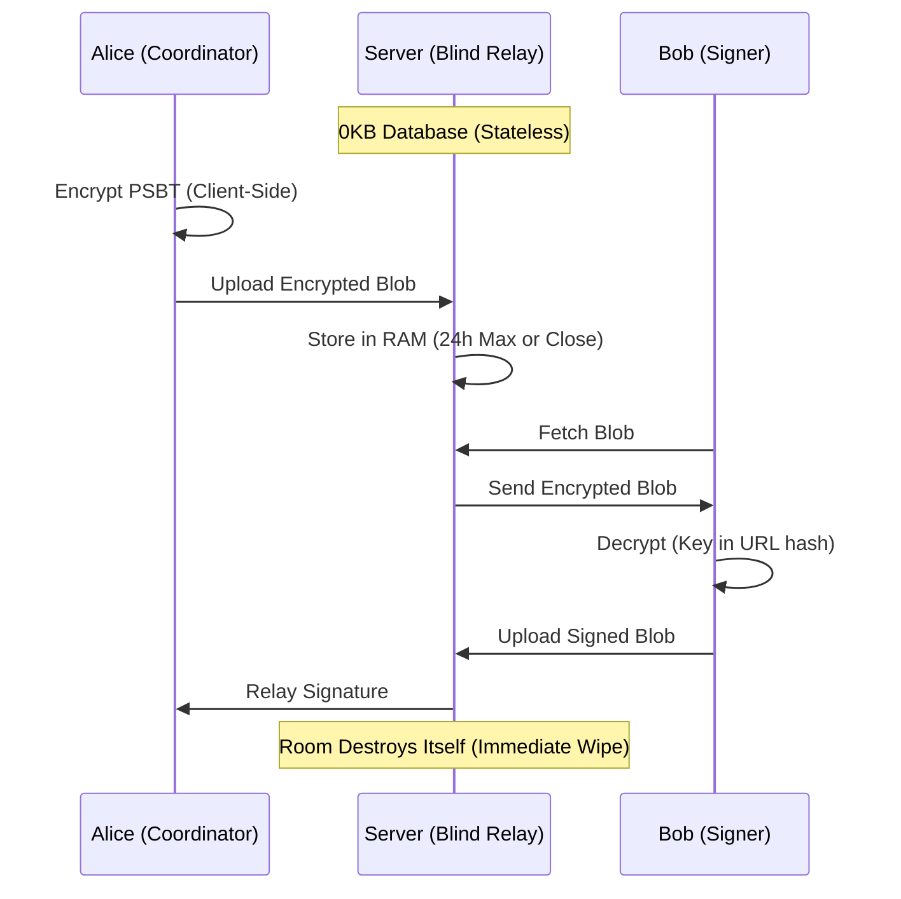

# Signing Room® (SigningRoom.io)

[](https://github.com/scarlin90/bip-stateless-psbt-coordination/blob/main/bip-draft.md)
[](https://signingroom.io)
[](https://arxiv.org/abs/2601.17875)
[](https://www.ulster.ac.uk/)

> **Stateless. Zero-Knowledge. Real-Time.**
> A stateless coordination layer for Bitcoin multisig transactions.


[](./site_metric_logs/MANIFEST.md)

---

### 📦 New: The Official SDK Ecosystem

You can now integrate Signing Room directly into your own infrastructure using our official libraries:

**1. The Core TypeScript SDK**
A framework-agnostic library for programmatic, event-driven multisig coordination.

- **Official NPM Package:** [`@signing-room/sdk`](https://www.npmjs.com/package/@signing-room/sdk)
- **Source & Demos:** [SDK GitHub Directory](https://github.com/scarlin90/signingroom/tree/main/libs/sdk)

**2. The Drop-In Web Component**
Integrating non-custodial multisig UI into your own application is now as easy as adding an HTML tag (`<signing-room>`).

- **Official NPM Package:** [`@signing-room/embed`](https://www.npmjs.com/package/@signing-room/embed)
- **Interactive Demo:** [SigningRoom Embed SDK Sandbox](https://signingroom.io/webcomponent-demo.html)

---

### ⚠️ Disclaimer

**Trademark Notice:** **"Signing Room"** is a **registered trademark** of **Stateless Research Ltd** in the United Kingdom.

**THIS SOFTWARE IS PROVIDED "AS IS", WITHOUT WARRANTY OF ANY KIND.**

SigningRoom is an open-source coordination tool, **not** a wallet, custodian, or financial institution.

- **We do not** hold your private keys.
- **We do not** hold your funds.
- **We cannot** recover lost data (rooms are ephemeral and exist only in RAM).

You are solely responsible for verifying the details of any transaction (address, amount, fees) on your hardware device screen before signing.

---

**SigningRoom** replaces the insecurity of emailing files and the friction of USB sticks with a secure, ephemeral, real-time signing room. We do not want your data. We cannot read your data.

## 🏴 The Manifesto

1.  **Human Rights via Physics:** We enforce **UN Article 20 (Freedom of Assembly)** and **Article 12 (Privacy)** not through policy, but through physics. By using ephemeral Durable Objects that self-destruct, we ensure that the "Right to Coordinate" is preserved even in hostile jurisdictions.
2.  **Statelessness is Security:** Databases are liabilities. SigningRoom stores data in RAM (Cloudflare Durable Objects) only for the duration of the session. When the room expires, the data ceases to exist.
3.  **Zero Knowledge:** All transaction data is encrypted **client-side** (AES-GCM) before it ever touches the network. The decryption key exists only in the URL fragment (`#key`), which is never sent to the server.
4.  **Don't Trust, Verify:** The client is verifiable. The cryptography is standard (Web Crypto API). The code is open.

## 📊 Forensic Verification (Data)

As a privacy-focused public good, we believe in complete operational transparency. Rather than asking for blind trust, we regularly publish verifiable site metrics to demonstrate the scale, efficiency, and real-world usage of the relay infrastructure.

Based on our latest 30-day forensic audit (period ending July 12, 2026):

- **Total Requests Handled:** 88,057
- **Total Network Bandwidth:** 3.58 GB
- **Community Adoption:** 5,803 aggregated monthly unique visitors.

### 🔍 Forensic Highlight

**Edge Caching Efficiency:** In the last 30 days, 1.76 GB (49.06% of total bandwidth) was served directly from the edge cache. Our global CDN architecture actively minimizes origin load, ensuring instantaneous coordination and absolute zero-latency for users worldwide. By optimizing static content delivery at the edge, we ensure the relay remains performant even during peak traffic periods, maintaining the "blind" and ephemeral nature of our coordination protocol.

### 🛡️ Transparency & Audits

To maintain strict compliance and absolute operational transparency, all core metrics, dependency structures, and security audits are preserved as verifiable assets directly within this repository:

📊 **Infrastructure Integrity:** Raw exported logs and historical performance data are logged publicly.
[View the Site Metrics Manifest](./site_metric_logs/MANIFEST.md)

📦 **Software Bill of Materials (SBOM):** In alignment with European Cyber Resilience Act (CRA) guidelines, we maintain a comprehensive machine-readable vulnerability mapping of our software supply chain.
[Verify our Security Supply Chain](./sbom.json)

## 🔬 Research & Standards

This software serves as the reference implementation for **"The Stateless Pattern,"** a cryptographic architecture formalized for both peer review and Bitcoin protocol standardization.

> 📜 **Bitcoin Improvement Proposal (BIP)**
> **[Draft: Stateless PSBT Coordination Relay](https://github.com/scarlin90/bip-stateless-psbt-coordination/blob/main/bip-draft.md)**
> _This proposal defines a standard for ephemeral, encrypted PSBT transport to ensure interoperability between stateless relays and coordinators._

> 🎓 **Academic Whitepaper**
> _Carlin, S. & Curran, K. (2026)._ **The Stateless Pattern: Ephemeral Coordination as the Third Pillar of Digital Sovereignty.** _arXiv preprint arXiv:2601.17875._
>
> [](https://arxiv.org/abs/2601.17875)

## ⚡ Features

- **Multi-Network Support:** Full support for **Mainnet**, **Testnet**, and **Signet** for safe testing and development.
- **PWA (Progressive Web App):** Installable on iOS/Android directly from the browser. Censorship-resistant mobile access without the App Store.
- **Real-Time Sync:** Utilizing WebSockets for instant state propagation between signers.
- **Hardware Agnostic:** Works with Coldcard, Sparrow, Electrum, Ledger, Trezor, and any BIP-174 compatible wallet.
- **Ephemeral Rooms:** All rooms and data self-destruct after **24 hours**.
- **Audit Logs:** Automatically generates a client-side, cryptographically verifiable PDF audit trail of the signing ceremony, now featuring persistent witness tracking for disconnected signers.

## 🛠️ Architecture

SigningRoom uses a **"Blind Relay"** architecture. It acts as a temporary switching station, not a warehouse.



## 🗺️ Roadmap (2026)

We are actively seeking funding and grants to evolve **SigningRoom** from a standalone tool into ubiquitous Bitcoin multisig infrastructure.

### Phase 1: The Core — ✅ Completed

- [x] Launch `signingroom-core` on Mainnet, Testnet, and Signet (v1.0)
- [x] Deploy censorship-resistant Progressive Web App (PWA) that bypasses app stores

### Phase 2: Ubiquity — ✅ Completed

- [x] **BIP Draft Submitted**: Standardizing Stateless Encrypted WebSocket Coordination for PSBTs
- [x] **Web Component (`<signing-room>`)**: Drop-in HTML element for easy third-party integration
- [x] **Extend Web Component Events**: Expose all events inside room for compliance and governance

### Phase 3: 🔴 Active Grant Target (Q3 2026)

- [x] **Build Typescript Client Library**: Create Typescript Client to simplify integrations to relay
- [x] **Youtube**: Create SDK walkthrough
- [x] **Dockerise**: Create docker images and setup
- [ ] **Stealth Room**: Prototype OHTTP with Web Transport or QUIC and MASQUE
- [ ] **Public API**: Well-documented API for automated agents and services

---

**Status**: Phase 1 complete. Phase 2 complete. Phase 3 is the current focus and primary grant target.

## 💰 Support Public Infrastructure

SigningRoom is Free and Open Source Software (FOSS), maintained for the public good. If this tool helps you or your organization, please consider supporting its maintenance.

[Support on OpenSats] (Application Initial Rejection Q1 - Feedback go BIP — Actively drafting BIP)

[Human Rights Foundation] (Bitcoin Development Fund — Deferred Q3 2026)

[Donate via Lightning] (Instant)

[](https://e94152ca5a.d.voltageapp.io/lnurlp/link/kfjCoo)

## 🚀 Quick Start (Development)

**Prerequisites:** Docker Desktop **OR** Node.js v20+.

### Option A: Docker Compose (Recommended)

Spin up the entire stack (Worker API + Angular Client served via Nginx) in isolated containers with a single command:

```bash
# 1. Clone the repository
git clone https://github.com/scarlin90/signingroom.git
cd signingroom

# 2. Build and start containers
docker compose up --build
```

**Frontend Client:** http://localhost:4200  
**Worker Relay:** http://localhost:8787

> To stop the containers, press <kbd>Ctrl</kbd> + <kbd>C</kbd> and run:
>
> ```bash
> docker compose down
> ```

### Option B: Native Local Setup

If you prefer running services directly on your host machine:

```bash
# 1. Clone the repository
git clone https://github.com/scarlin90/signingroom.git
cd signingroom

# 2. Install dependencies
npm install

# 3. Start the Backend (Worker) in Terminal A
cd apps/worker
npx wrangler dev

# 4. Start the Frontend (Client) in Terminal B (from project root)
npx nx run client:serve --configuration=development
```

**Frontend Client:** http://localhost:4200  
**Worker Relay:** http://localhost:8787

---

## 🏰 Self-Hosting (Sovereign)

We believe in true sovereignty. You should never be locked into a platform. While SigningRoom.io offers a hosted demo for convenience, you are free to inspect the code and run your own infrastructure anywhere.

### Option 1: Docker Containers (Fully Independent / Any VPS)

Run the entire blind relay stack on your own Linux server, home node, or cloud provider without external serverless dependencies:

```bash
# 1. Clone your repository
git clone https://github.com/scarlin90/signingroom.git
cd signingroom

# 2. Start the stack in detached mode
docker compose up -d --build
```

#### Custom Domain / Reverse Proxy Setup

Point your Nginx, Caddy, or Traefik reverse proxy to:

- **Client (UI):** http://localhost:4200
- **Worker (Relay API):** http://localhost:8787

### Option 2: Managed Edge (Cloudflare Workers & Pages)

If you prefer deploying directly to Cloudflare's global edge network, you will need a Cloudflare account:

```bash
# Deploy the Worker (Backend API)
npm run deploy:worker

# Deploy the Client (Frontend UI)
npm run deploy:client
```

**Environment Variables**

Set these in your `wrangler.jsonc` or the Cloudflare Dashboard:

- `ALLOWED_ORIGIN`: Your frontend URL (e.g. `https://my-signing-room.com`)

## 🧪 Testing & Quality Assurance

The most reliable way to run these tests—including Unit, Worker, and Playwright E2E flows—is via Docker to ensure environment isolation.

### Run All Tests (Unit + E2E)

Execute these two commands to build the test environment and run the full suite:

#### 1. Build the test image

```Bash
docker build -t signing-room-tests -f Dockerfile.test .
```

#### 2. Run the suite (Unit + E2E)

```Bash
docker run --rm signing-room-tests
```

### Local Development Commands

If you prefer running specific layers during active development:

#### Unit Tests (Client):

```Bash
npx nx run client:test
```

#### Worker Tests (Server):

```Bash
npx nx run worker:test
```

#### Interactive E2E (Playwright UI):

> Note : To run the UI you need to remove the docker configuration from the playwright.config.ts

In playwright.config.ts remove --ip 0.0.0.0 --port 8787 before running the e2e command

```Bash
Before - With Docker configuration
command: 'npx wrangler dev apps/worker/src/index.ts --ip 0.0.0.0 --port 8787'

After - After without Docker configuration - ready for playwright UI
command: 'npx wrangler dev apps/worker/src/index.ts'
```

Run the e2e command after config change

```Bash
npx nx e2e client-e2e --ui
```

## 🏢 Enterprise & Commercial Licensing

**SigningRoom.io** is fully open-source under the **AGPLv3 License**.

- **Community Use:** Free for everyone. If you modify the code and host it publicly, you must open-source your changes.
- **Commercial Use:** Institutions requiring a **Commercial License (AGPL Waiver)** to integrate this technology into proprietary, closed-source infrastructure (e.g., internal banking systems, custodial platforms) must contact **Stateless Research Ltd**.

> 🔗 **[Contact Stateless Research for Licensing](https://statelessresearch.com)**

## 📄 License

Distributed under the GNU Affero General Public License v3.0 (AGPL-3.0). If you modify this code and run it over a network, you must release your source code. See LICENSE for more information.

## 🔐 Security

If you discover a vulnerability, please do NOT open a public issue. Email the maintainer directly or use PGP.

PGP Fingerprint: C642 EB5E 3EB8 5194 98CF 6535 97A4 B80F 7970 DD56

Email: security@signingroom.io

Built with 🧡 and ⚡ by Stateless Research Ltd.
Signing Room® is a registered trademark of Stateless Research Ltd.
