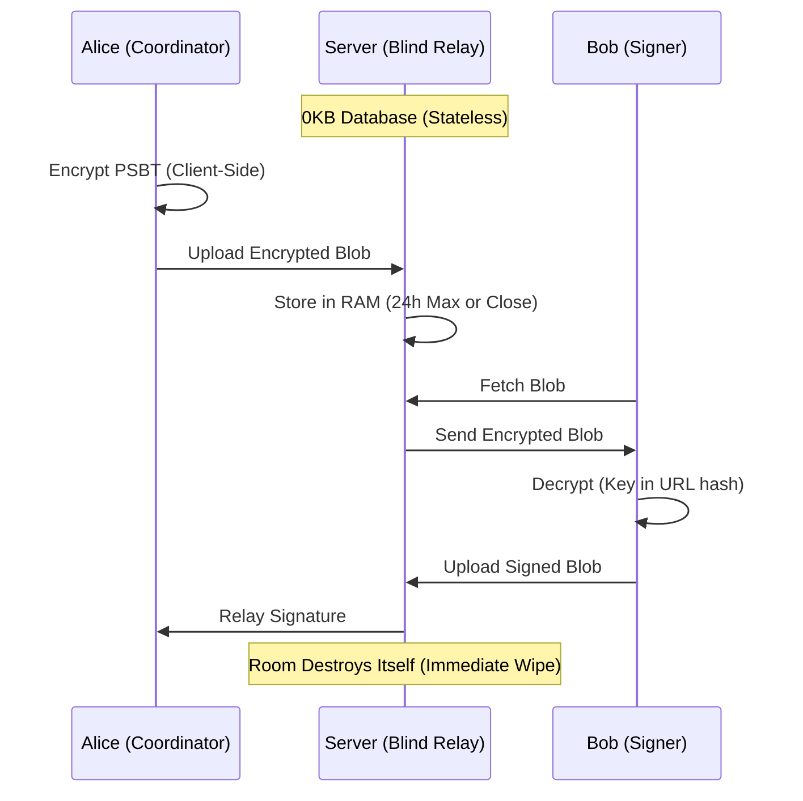

# SigningRoom.io

[](https://github.com/scarlin90/bip-stateless-psbt-coordination/blob/main/bip-draft.md)
[](https://signingroom.io)
[](https://arxiv.org/abs/2601.17875)
[](https://www.ulster.ac.uk/)

> **Stateless. Zero-Knowledge. Real-Time.**
> A stateless coordination layer for Bitcoin multisig transactions.


[](./site_metric_logs/MANIFEST.md)

---

### ⚠️ Disclaimer

**THIS SOFTWARE IS PROVIDED "AS IS", WITHOUT WARRANTY OF ANY KIND.**

SigningRoom is an open-source coordination tool, **not** a wallet, custodian, or financial institution.
* **We do not** hold your private keys.
* **We do not** hold your funds.
* **We cannot** recover lost data (rooms are ephemeral and exist only in RAM).

You are solely responsible for verifying the details of any transaction (address, amount, fees) on your hardware device screen before signing.

---

**SigningRoom** replaces the insecurity of emailing files and the friction of USB sticks with a secure, ephemeral, real-time signing room. We do not want your data. We cannot read your data.

## 🏴 The Manifesto

1.  **Human Rights via Physics:** We enforce **UN Article 20 (Freedom of Assembly)** and **Article 12 (Privacy)** not through policy, but through physics. By using ephemeral Durable Objects that self-destruct, we ensure that the "Right to Coordinate" is preserved even in hostile jurisdictions.
2.  **Statelessness is Security:** Databases are liabilities. SigningRoom stores data in RAM (Cloudflare Durable Objects) only for the duration of the session. When the room expires, the data ceases to exist.
3.  **Zero Knowledge:** All transaction data is encrypted **client-side** (AES-GCM) before it ever touches the network. The decryption key exists only in the URL fragment (`#key`), which is never sent to the server.
4.  **Don't Trust, Verify:** The client is verifiable. The cryptography is standard (Web Crypto API). The code is open.

## 📊 Forensic Verification (Data)

The "Stateless Pattern" is not just a theory; it is verified in production. We publish our raw Cloudflare traffic logs to prove the "Blind Relay" architecture handles volume without retaining user state.

**Live Mainnet Traffic Analysis (Mar 21, 2026):**

| Metric | Value | Implication |
| :--- | :--- | :--- |
| **Total Requests (24h)** | **812** | **Continuous Availability:** Steady-state operations following the v1.6.0 deployment window. |
| **Data Served (24h)** | **73.77 MB** | **Blind Relay Proven:** ~74 MB of encrypted coordination data relayed with 0 bytes stored on disk. |
| **Peak Throughput** | **34.82 MB (1h)** | **The v1.6.0 Signal:** A massive throughput spike at 11:00 AM confirms institutional-density ceremonies. |
| **User State Retained** | **0.00 B** | **Proof of Blind Relay.** The server retained 0 bytes of user session data. |

### 🔍 Forensic Highlight: The "v1.6.0 Ceremony" (Mar 21, 2026)
Our latest audit reveals the emergence of high-weight coordination events following the release of the Enterprise Audit system:

* **Metric:** A massive **34.82 MB Data Spike** occurred at 11:00 AM.
* **Analysis:** This represents the highest single-hour data density recorded to date. Despite a ~66% cache ratio (indicating broad v1.6.0 PWA downloads), the **11.72 MB Uncached Signature** confirms a complex, real-time coordination ceremony involving multiple high-weight PSBTs.
* **The Proof:** Despite moving ~74 MB of total data in 24 hours (and ~1.94 GB over the last 30 days), the data retention size remained at **0KB**. The server acted purely as a "Vacuum," relaying encrypted packets without writing a single byte to persistent storage.

---

### 🛡️ Transparency & Audits
We don't just claim to be stateless; we prove it. We publish our raw traffic logs so you can verify our "Zero-Knowledge" architecture yourself.

* **Latest Audit:** [Mar 21, 2026](./site_metric_logs/MANIFEST.md#-2026-03-21_audit)
* **Traffic Volume:** 812 Requests / 480 Active Sessions (Proxy)
* **Key Finding:** Sustained "Institutional Rhythm" with a 34MB+ peak density event confirming the success of the new E2EE Witness system.

> 📂 **[View the full Data Manifest](./site_metric_logs/MANIFEST.md)** to inspect the raw CSV logs.

## 🔬 Research & Standards

This software serves as the reference implementation for **"The Stateless Pattern,"** a cryptographic architecture formalized for both peer review and Bitcoin protocol standardization.

> 📜 **Bitcoin Improvement Proposal (BIP)**
> **[Draft: Stateless PSBT Coordination Relay](https://github.com/scarlin90/bip-stateless-psbt-coordination/blob/main/bip-draft.md)**
> *This proposal defines a standard for ephemeral, encrypted PSBT transport to ensure interoperability between stateless relays and coordinators.*

> 🎓 **Academic Whitepaper**
> *Carlin, S. & Curran, K. (2026).* **The Stateless Pattern: Ephemeral Coordination as the Third Pillar of Digital Sovereignty.** *arXiv preprint arXiv:2601.17875.*
>
> [](https://arxiv.org/abs/2601.17875)

## ⚡ Features

* **Multi-Network Support:** Full support for **Mainnet**, **Testnet**, and **Signet** for safe testing and development.
* **PWA (Progressive Web App):** Installable on iOS/Android directly from the browser. Censorship-resistant mobile access without the App Store.
* **Real-Time Sync:** Utilizing WebSockets for instant state propagation between signers.
* **Hardware Agnostic:** Works with Coldcard, Sparrow, Electrum, Ledger, Trezor, and any BIP-174 compatible wallet.
* **Ephemeral Rooms:** All rooms and data self-destruct after **24 hours**.
* **Audit Logs:** Automatically generates a client-side, cryptographically verifiable PDF audit trail of the signing ceremony.

## 🛠️ Architecture

SigningRoom uses a **"Blind Relay"** architecture. It acts as a temporary switching station, not a warehouse.


## 🗺️ Roadmap (2026)
We are seeking funding to evolve SigningRoom from a standalone tool into ubiquitous infrastructure.

[x] Phase 1: The Core (Completed)
[x] Launch signingroom-core on Mainnet, Testnet, and Signet (v1.0).
[x] Deploy Censorship-Resistant PWA (Bypasses App Stores).

[ ] Phase 2: Ubiquity (Q1 2026) — 🔴 Active Grant Target
[x] **BIP Draft Submitted:** Standardizing Stateless PSBT Coordination.
[ ] **Web Component (<signing-room>):** A drop-in HTML element for third-party integration.
[ ] **Public API:** Documented WebSocket API for automated agents.

[ ] Phase 3: The UX Upgrade (Q3 2026)
[ ] Native iOS/Android App: Specific development to enable NFC support for tapping hardware wallets (Coldcard/Tapsigner) directly against the phone.
[ ] Third-party security audit of the cryptographic primitives.

## 💰 Support Public Infrastructure
SigningRoom is Free and Open Source Software (FOSS), maintained for the public good. If this tool helps you or your organization, please consider supporting its maintenance.

[Support on OpenSats] (Application Initial Rejection Q1 - Feedback go BIP — Actively drafting BIP)

[Human Rights Foundation] (Bitcoin Development Fund — Deferred Q2 2026)

[Donate via Lightning] (Instant)

[](https://e94152ca5a.d.voltageapp.io/lnurlp/link/kfjCoo)

## 🚀 Quick Start (Development)
Prerequisites: Node.js v20+.

```

# 1. Clone the repo
git clone [https://github.com/scarlin90/signingroom.git](https://github.com/scarlin90/signingroom.git)
cd signingroom

# 2. Install dependencies
npm install

# 3. Start the Development Server
# You will need two terminals:

# Terminal A: Start the Backend (Worker)
cd apps/worker
npx wrangler dev

# Terminal B: Start the Frontend (Client)
# (Run this from the project root)
npx nx run client:serve --configuration=development

# Access the Application:
# Frontend: http://localhost:4200
# Worker:   http://localhost:8787
```

## 🏰 Self-Hosting (Sovereign)
We believe in true sovereignty. You should never be locked into a platform. While SigningRoom.io offers a hosted demo for convenience, you are free to inspect the code and run your own infrastructure.

Cloudflare Workers You need a Cloudflare account to deploy the backend.

```

# Deploy the Worker (Backend)
npm run deploy:worker

# Deploy the Client (Frontend)
npm run deploy:client

Environment Variables Set these in your wrangler.jsonc or Cloudflare Dashboard:

ALLOWED_ORIGIN: Your frontend URL (e.g., https://my-signing-room.com).

```
## 🤝 Contributing
We need your help. SigningRoom is a community-run project. We welcome code, documentation, translations, and security audits.

## ⚠️ The "Blind Server" Rule
Before contributing, please understand our core constraint:

The server must NEVER know the content of the room. Any PR that introduces server-side logging, analytics, or persistent storage of user data will be rejected immediately.

🛠️ How to Contribute
Fork the project on GitHub.

Create your Feature Branch (git checkout -b feature/AmazingFeature).

Commit your changes (git commit -m 'Add some AmazingFeature').

Push to the Branch (git push origin feature/AmazingFeature).

Open a Pull Request.

## ⚡ Priority Needs
We are currently looking for help with:

[ ] Translations: Adding new languages for the UI.

[ ] Wallet Support: Testing and verifying new hardware wallets.

[ ] Accessibility: improving ARIA labels for screen readers.

## 🏢 Enterprise & Commercial Licensing
**SigningRoom.io** is fully open-source under the **AGPLv3 License**. 

* **Community Use:** Free for everyone. If you modify the code and host it publicly, you must open-source your changes.
* **Commercial Use:** Institutions requiring a **Commercial License (AGPL Waiver)** to integrate this technology into proprietary, closed-source infrastructure (e.g., internal banking systems, custodial platforms) must contact **Stateless Research Ltd**.

> 🔗 **[Contact Stateless Research for Licensing](https://statelessresearch.com)**

## 📄 License
Distributed under the GNU Affero General Public License v3.0 (AGPL-3.0). If you modify this code and run it over a network, you must release your source code. See LICENSE for more information.

## 🔐 Security
If you discover a vulnerability, please do NOT open a public issue. Email the maintainer directly or use PGP.

PGP Fingerprint: C642 EB5E 3EB8 5194 98CF 6535 97A4 B80F 7970 DD56

Email: security@signingroom.io

Built with 🧡 and ⚡ by Stateless Research Ltd.
