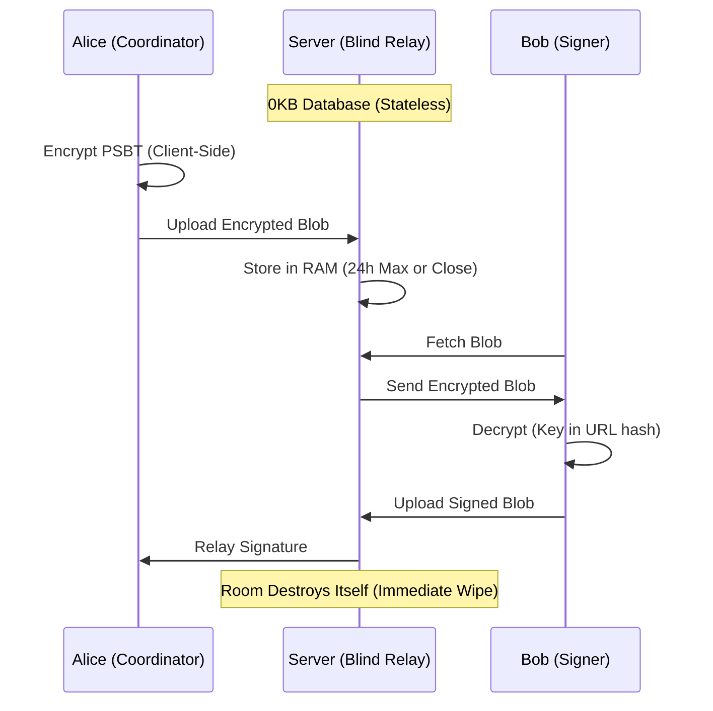

# SigningRoom.io

[](https://signingroom.io)
[](https://www.ulster.ac.uk/)

> **Stateless. Zero-Knowledge. Real-Time.**
> A stateless coordination layer for Bitcoin multisig transactions.


[](./MANIFEST.md)

---

### ⚠️ Disclaimer

**THIS SOFTWARE IS PROVIDED "AS IS", WITHOUT WARRANTY OF ANY KIND.**

SigningRoom is an open-source coordination tool, **not** a wallet, custodian, or financial institution.
* **We do not** hold your private keys.
* **We do not** hold your funds.
* **We cannot** recover lost data (rooms are ephemeral and exist only in RAM).

You are solely responsible for verifying the details of any transaction (address, amount, fees) on your hardware device screen before signing.

---

**SigningRoom** replaces the insecurity of emailing files and the friction of USB sticks with a secure, ephemeral, real-time signing room. We do not want your data. We cannot read your data.

## 🏴 The Manifesto

1.  **Human Rights via Physics:** We enforce **UN Article 20 (Freedom of Assembly)** and **Article 12 (Privacy)** not through policy, but through physics. By using ephemeral Durable Objects that self-destruct, we ensure that the "Right to Coordinate" is preserved even in hostile jurisdictions.
2.  **Statelessness is Security:** Databases are liabilities. SigningRoom stores data in RAM (Cloudflare Durable Objects) only for the duration of the session. When the room expires, the data ceases to exist.
3.  **Zero Knowledge:** All transaction data is encrypted **client-side** (AES-GCM) before it ever touches the network. The decryption key exists only in the URL fragment (`#key`), which is never sent to the server.
4.  **Don't Trust, Verify:** The client is verifiable. The cryptography is standard (Web Crypto API). The code is open.

## 📊 Forensic Verification (Data)

The "Stateless Pattern" is not just a theory; it is verified in production. We publish our raw Cloudflare traffic logs to prove the "Blind Relay" architecture handles volume without retaining user state.

**Live Mainnet Traffic Analysis (Jan 15, 2026):**

| Metric | Value | Implication |
| :--- | :--- | :--- |
| **Total Requests (24h)** | 878 | Active Mainnet & PWA usage. |
| **Data Served** | **50.67 MB** | Normalized throughput following PWA stabilization. |
| **Data Cached (Static)** | **70.5%** | **Efficiency Restored:** The majority of traffic is now served from the edge (High Cache), proving earlier dips were temporary deployment signals. |
| **User State Retained** | **0.00 B** | **Proof of Blind Relay.** The server retained 0 bytes of user session data. |

> **🔍 Forensic Highlight:**
> While most traffic was cached (~90% efficiency at 12 PM), a specific **0% Cache Spike** occurred at **16:00 (4 PM)**, moving **11.55 MB**. This "Uncached" signature confirms a live, encrypted coordination event where unique data passed through the relay without being written to disk.

---
### 🛡️ Transparency & Audits
We publish daily traffic logs to verify our "Stateless" claim.
* **Latest Audit:** 15 Jan 2026
* **Daily Visitors:** 153 (New Peak)
* **Data Served:** 50.67 MB
* [View Full Manifest](./MANIFEST.md)

📂 **View Raw Metric Logs:**
* [📂 **Latest Audit: Jan 15, 2026**](./site_metric_logs/2026-01-15_audit/)
* [📂 **Archive: Jan 12, 2026**](./site_metric_logs/2026-01-12_audit/)

## 🔬 Academic Research

This software serves as the reference implementation for **"The Stateless Pattern,"** a cryptographic architecture currently being formalized for peer review.

> **Research Collaboration:**
> *Carlin, S. & Curran, K. (2026).* **(Forthcoming).** Research regarding ephemeral coordination and privacy-preserving architectures in low-trust networks. *Intelligent Systems Research Centre, Ulster University.*

## ⚡ Features

* **Multi-Network Support:** Full support for **Mainnet**, **Testnet**, and **Signet** for safe testing and development.
* **PWA (Progressive Web App):** Installable on iOS/Android directly from the browser. Censorship-resistant mobile access without the App Store.
* **Real-Time Sync:** Utilizing WebSockets for instant state propagation between signers.
* **Hardware Agnostic:** Works with Coldcard, Sparrow, Electrum, Ledger, Trezor, and any BIP-174 compatible wallet.
* **Ephemeral Rooms:** All rooms and data self-destruct after **24 hours**.
* **Audit Logs:** Automatically generates a client-side, cryptographically verifiable PDF audit trail of the signing ceremony.

## 🛠️ Architecture

SigningRoom uses a **"Blind Relay"** architecture. It acts as a temporary switching station, not a warehouse.



🗺️ Roadmap (2026)
We are seeking funding to evolve SigningRoom from a standalone tool into ubiquitous infrastructure.

[x] Phase 1: The Core (Completed)

Launch signingroom-core on Mainnet, Testnet, and Signet (v1.0).

Deploy Censorship-Resistant PWA (Bypasses App Stores).

Achieve 0% Data Retention (Verified).

[ ] Phase 2: Ubiquity (Q1 2026) — 🔴 Active Grant Target (Software Dev)

Web Component (<signing-room>): A drop-in HTML element allowing any exchange, wallet, or DAO to embed a secure signing room directly into their UI.

Public API: A documented WebSocket API allowing programmatic coordination for automated signing bots and agents.

(Research Output: Formal Verification of the "Stateless Pattern" will be published independently by Ulster University).

[ ] Phase 3: The UX Upgrade (Q3 2026)

Native iOS/Android App: Specific development to enable NFC support for tapping hardware wallets (Coldcard/Tapsigner) directly against the phone.

Third-party security audit of the cryptographic primitives.

💰 Support Public Infrastructure
SigningRoom is Free and Open Source Software (FOSS), maintained for the public good. If this tool helps you or your organization, please consider supporting its maintenance.

[Support on OpenSats] (Application Submitted — Pending Review)

[Human Rights Foundation] (Bitcoin Development Fund — Shortlisted March 2026)

[Donate via Lightning] (Instant)
  [](https://e94152ca5a.d.voltageapp.io/lnurlp/link/kfjCoo)

🚀 Quick Start (Development)
Prerequisites: Node.js v20+.

```bash

# 1. Clone the repo
git clone [https://github.com/seancarlin/signing-room.git](https://github.com/seancarlin/signing-room.git)
cd signing-room

# 2. Install dependencies
npm install

# 3. Start the Development Server
npm start
Frontend: http://localhost:4200 Worker: http://localhost:8787

🏰 Self-Hosting (Sovereign)
We believe in true sovereignty. You should never be locked into a platform. While SigningRoom.io offers a hosted demo for convenience, you are free to inspect the code and run your own infrastructure.

Cloudflare Workers You need a Cloudflare account to deploy the backend.

# Deploy the Worker (Backend)
npm run deploy:worker

# Deploy the Client (Frontend)
npm run deploy:client
Environment Variables Set these in your wrangler.toml or Cloudflare Dashboard:

ALLOWED_ORIGIN: Your frontend URL (e.g., https://my-signing-room.com).
```
🤝 Contributing
We need your help. SigningRoom is a community-run project. We welcome code, documentation, translations, and security audits.

⚠️ The "Blind Server" Rule
Before contributing, please understand our core constraint:

The server must NEVER know the content of the room. Any PR that introduces server-side logging, analytics, or persistent storage of user data will be rejected immediately.

🛠️ How to Contribute
Fork the project on GitHub.

Create your Feature Branch (git checkout -b feature/AmazingFeature).

Commit your changes (git commit -m 'Add some AmazingFeature').

Push to the Branch (git push origin feature/AmazingFeature).

Open a Pull Request.

⚡ Priority Needs
We are currently looking for help with:

[ ] Translations: Adding new languages for the UI.

[ ] Wallet Support: Testing and verifying new hardware wallets.

[ ] Accessibility: improving ARIA labels for screen readers.

📄 License
Distributed under the GNU Affero General Public License v3.0 (AGPL-3.0). If you modify this code and run it over a network, you must release your source code. See LICENSE for more information.

🔐 Security
If you discover a vulnerability, please do NOT open a public issue. Email the maintainer directly or use PGP.

PGP Fingerprint: C642 EB5E 3EB8 5194 98CF 6535 97A4 B80F 7970 DD56

Email: security@signingroom.io

Built with 🧡 and ⚡ by Sean Carlin.