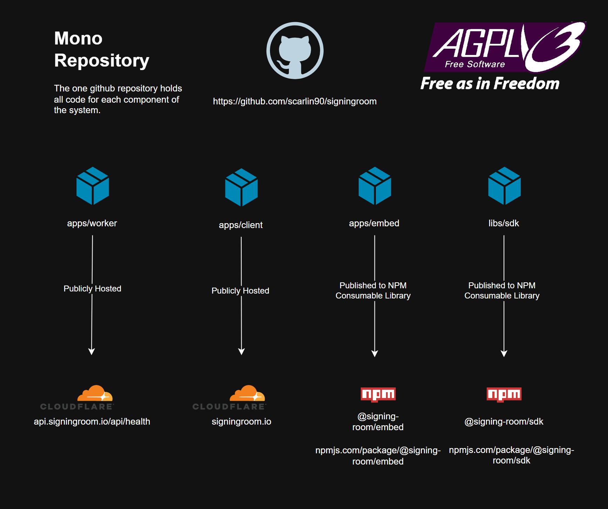
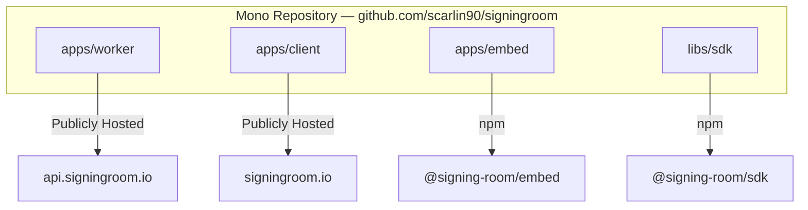
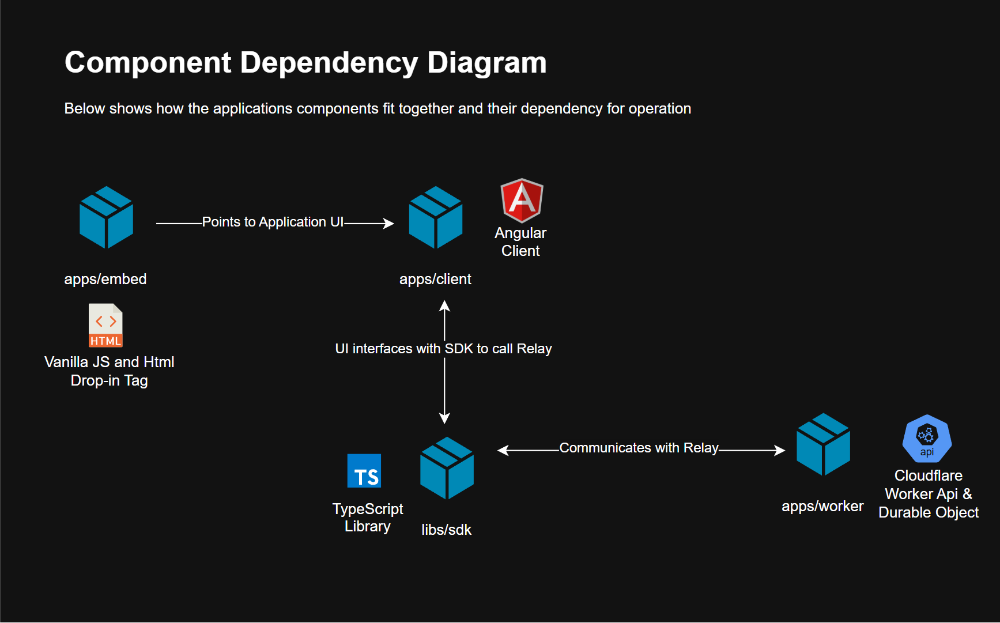
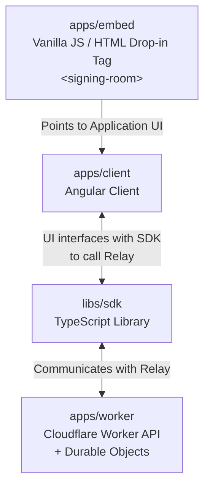
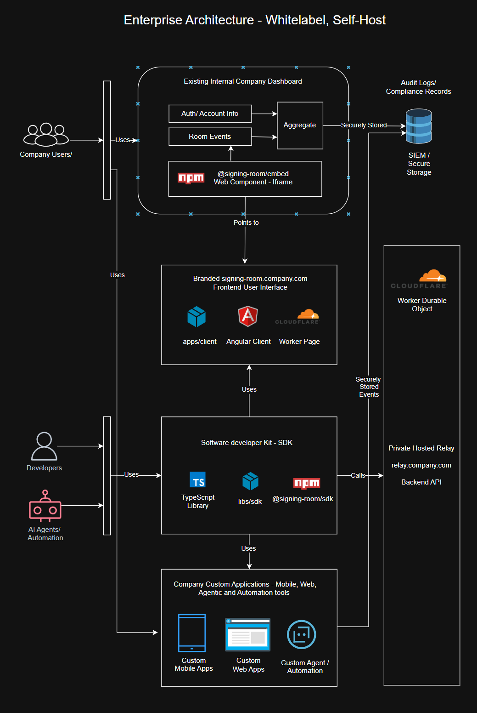
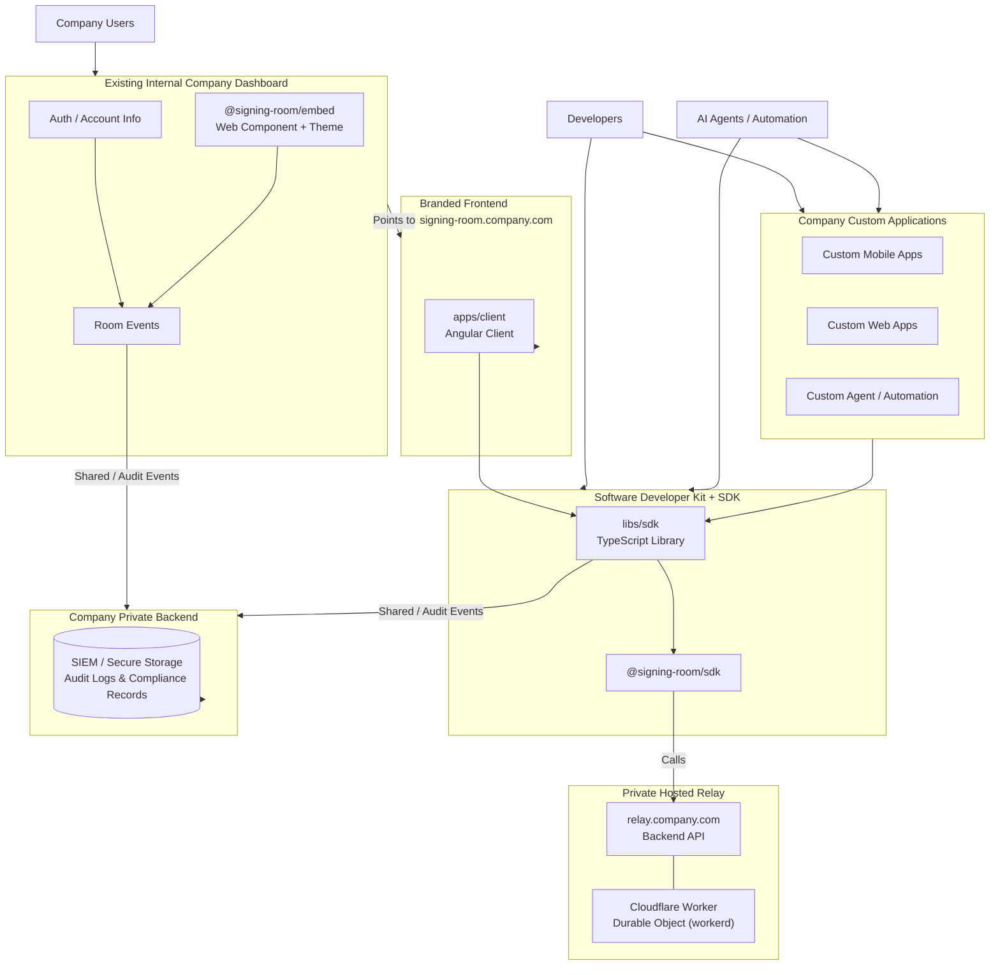

Here’s the updated `ARCHITECTURE.md` using the three separate images:

````markdown
# Signing Room — Project Architecture

**Entity:** Stateless Research Ltd  
**Repository:** [github.com/scarlin90/signingroom](https://github.com/scarlin90/signingroom)  
**License:** AGPLv3 (core) + Commercial dual-license options

**Last Reviewed:** 7 August 2026

This document describes the high-level architecture of Signing Room, from the monorepo layout through component relationships to the enterprise white-label deployment model.

---

## 1. Monorepo Overview

The single GitHub repository contains all source code for every component of the system.



| Component       | Path          | Distribution / Hosting                    | Purpose                                            |
| --------------- | ------------- | ----------------------------------------- | -------------------------------------------------- |
| Worker (Relay)  | `apps/worker` | Publicly hosted → `api.signingroom.io`    | Cloudflare Worker + Durable Objects (blind relay)  |
| Client (Web UI) | `apps/client` | Publicly hosted → `signingroom.io`        | Angular frontend (PWA)                             |
| Embed           | `apps/embed`  | Published to npm as `@signing-room/embed` | Drop-in web component (`<signing-room>`)           |
| SDK             | `libs/sdk`    | Published to npm as `@signing-room/sdk`   | Framework-agnostic TypeScript coordination library |


````

---

## 2. Component Dependency Diagram

How the pieces fit together at runtime:





**Key points:**

- All cryptographic operations (key handling, PSBT creation/signing, AES-256-GCM encryption) happen **client-side** inside the SDK or the embedding application.
- The Worker acts purely as a **blind, ephemeral relay**. It never sees plaintext PSBTs or private keys.
- The Embed package is a thin web-component wrapper that can be dropped into any site and points at a client UI + relay of the integrator’s choosing.

---

## 3. Enterprise Architecture — Whitelabel / Self-Hosted

Enterprises can run a fully isolated deployment while still using the open-source components.





### Enterprise characteristics

- **Full isolation** — The company hosts its own relay (`relay.company.com`) and frontend.
- **Audit ownership** — Room events and security/audit events are sent to the **company’s private backend**, which is responsible for storing them in the SIEM or secure database. The relay itself does **not** write directly to the SIEM.
- **No vendor lock-in** — The underlying protocol is an open BIP draft; the SDK and worker are open source.
- **Flexible integration** — Teams can embed the web component, call the SDK from custom apps, or drive coordination from AI agents / automation.

---

## 4. Core Design Principles (Summary)

| Principle              | Implementation                                    |
| ---------------------- | ------------------------------------------------- |
| Statelessness          | Durable Objects live only in RAM; rooms expire    |
| Zero Knowledge         | Client-side AES-256-GCM; key in URL fragment only |
| Blind Relay            | Worker never sees plaintext PSBTs or keys         |
| Supply-Chain Integrity | Cosign signatures + SLSA Level 3 + CycloneDX SBOM |
| Sovereign Deployment   | Official images + source builds for self-hosting  |

---

## Related Documents

- [Regulatory Scope & Compliance Boundary](./regulatory-scope.md)
- [Incident Response Runbook](./incident-response-runbook.md)
- [Technical Security & Compliance Roadmap](./technical-roadmap.md)
- [Security Policy](../SECURITY.md)

```

The three images are now referenced individually in their respective sections, and the Mermaid diagrams remain as accessible, version-controllable alternatives.
```
